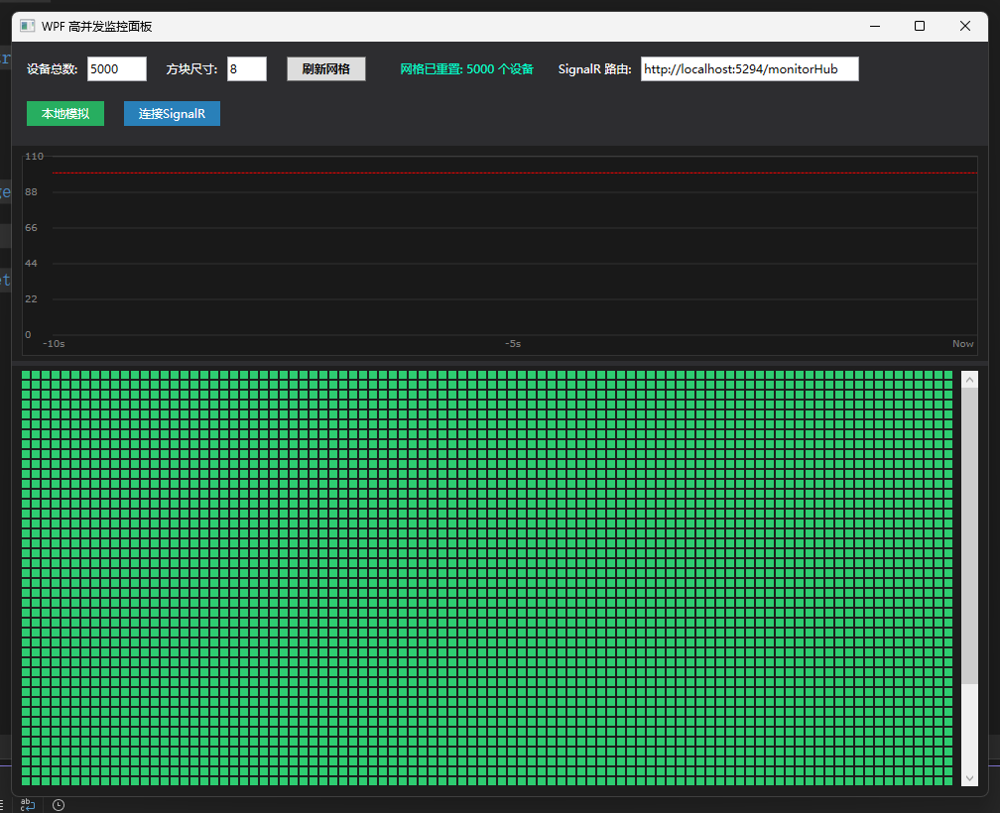
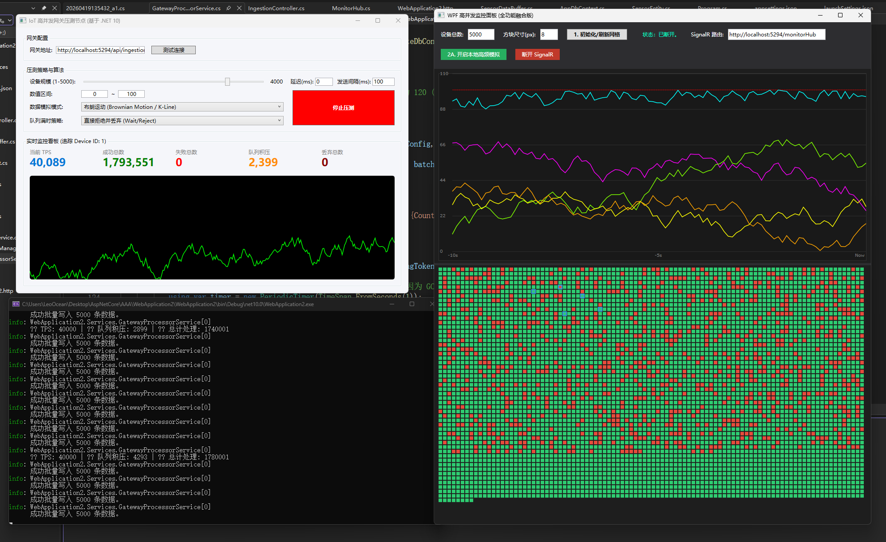

# WPF 上位机监控平台

一个基于 WPF 的高性能实时监控面板，通过 SignalR 与后端服务器建立双工通信，支持大规模设备网格可视化、实时波形绘制及智能订阅机制，能够流畅承载 **5,000+** 设备的并发状态更新。

------

## 📸 界面预览

<p align="center">  </p>

------

## ✨ 功能特性

### 1. 高密度设备网格

- 支持 **1 ~ 5,000** 个设备的网格化展示
- 自定义方块尺寸，自适应窗口大小
- 点击方块即可 **订阅/取消订阅** 设备，被订阅的设备将推送实时波形数据

### 2. 双模式数据源

| 模式             | 说明                                             |
| :--------------- | :----------------------------------------------- |
| **本地模拟**     | 在无服务器环境下，生成模拟数据用于 UI 测试与调试 |
| **真实 SignalR** | 连接高并发服务器，接收真实传感器数据与告警事件   |

### 3. 低延迟实时波形图

- 基于 `DrawingVisual` 自定义渲染，完全绕过 WPF 布局系统，实现 **60 FPS** 流畅绘图
- 每设备最多保留 100 个数据点，形成滚动时间窗口
- 支持多设备同时绘制，使用不同颜色区分

### 4. 智能订阅与推流

- 仅当用户 **点击选中** 设备时，才向服务器发起订阅请求
- 服务器通过 SignalR **Group** 精准推送，避免无效数据传输
- 被订阅设备的数据以 **100ms 批量** 推送，大幅降低网络开销

### 5. 状态自动恢复

- 异常状态（如超过阈值）持续高亮，**3 秒无新异常后自动恢复为正常色**
- 有效避免因网络抖动或瞬时峰值导致的界面闪烁

### 6. 实时性能指标

- 在状态栏展示网关的 **TPS（每秒事务数）** 与累计处理总量
- 直观反映后端服务器处理能力

------

## 🧱 架构设计

text

```
┌──────────────────────────────────────────────┐
│                   MainWindow                 │
│  ┌─────────────┐  ┌─────────────┐  ┌────────┐│
│  │ 网格控件    │  │ 波形图控件  │  │ 状态栏 ││
│  └──────┬──────┘  └──────┬──────┘  └────┬───┘│
│         │                │               │    │
│         └────────────────┼───────────────┘    │
│                          │                    │
│              ┌───────────▼───────────┐        │
│              │    订阅管理器（内存）   │        │
│              └───────────┬───────────┘        │
│                          │                    │
│              ┌───────────▼───────────┐        │
│              │      SignalR 客户端    │        │
│              └───────────┬───────────┘        │
└──────────────────────────┼────────────────────┘
                           │ WebSocket
                           ▼
              ┌─────────────────────────┐
              │   高并发服务器（SignalR）│
              └─────────────────────────┘
```


### 数据流向

1. **用户点击方块** → `DeviceMapControl` 触发 `DeviceSelectionToggled` 事件
2. `MainWindow` 调用 `SubscribeDevice` / `UnsubscribeDevice` → 通过 SignalR 通知服务器
3. 服务器将数据推送到对应的 **Group** → 客户端 `ReceiveDetailBatch` 回调接收批量数据
4. 数据放入无锁队列 `ConcurrentQueue<DeviceStateUpdate>`，由渲染定时器（60Hz）消费
5. 渲染定时器更新网格状态并追加波形数据 → `RealTimeChartControl` 重绘

------

## 🔧 核心组件详解

### 1. `RealTimeChartControl` – 高性能波形图控件

继承自 `FrameworkElement`，使用 **VisualCollection + DrawingVisual** 实现极速渲染。

csharp

```
protected override void OnRenderSizeChanged(SizeChangedInfo sizeInfo)
{
    RenderBackground();  // 绘制网格、坐标轴（仅尺寸变化时重绘）
    RenderChart();       // 重绘所有曲线
}

public void AddData(int deviceId, double value, Color color)
{
    // 数据仅存入内存队列，不立即触发渲染
    // 由外部 60Hz 定时器统一调用 RenderChart()
}
```


**性能优化点：**

- 背景与坐标轴 **仅在尺寸变化时重绘**，避免每帧重复绘制静态元素
- 波形线使用 `StreamGeometry` 构建，并调用 `Freeze()` 冻结以提高渲染性能
- 采用 `Pen` 预创建与冻结，减少资源开销

### 2. `DeviceMapControl` – 高密度设备网格控件

同样基于 `DrawingVisual`，每个设备方块对应一个独立的 `DrawingVisual` 节点。

csharp

```
private void RenderNode(DeviceNode node)
{
    using DrawingContext dc = node.Visual.RenderOpen();
    Brush brush = node.IsError ? ErrorBrush : NormalBrush;
    dc.DrawRectangle(brush, node.IsSelected ? SelectedPen : null, node.Bounds);
}
```


**交互设计：**

- 点击方块时计算行列索引 → 切换 `IsSelected` 状态 → 触发订阅事件
- 状态更新（如异常）仅重绘该方块对应的 `DrawingVisual`，**不影响其他 4999 个方块**
- 支持动态调整方块尺寸与窗口自适应（`MeasureOverride` + `ReflowVisuals`）

### 3. SignalR 集成与数据缓冲

**连接配置：**

csharp

```
_hubConnection = new HubConnectionBuilder()
    .WithUrl("http://localhost:5294/monitorHub")
    .WithAutomaticReconnect()
    .Build();
```


**关键回调：**

| 方法                 | 作用                                     |
| :------------------- | :--------------------------------------- |
| `ReceiveStatus`      | 每秒接收服务端 TPS 与总处理量            |
| `ReceiveAlertBatch`  | 接收批量告警事件（值 >100 或 <0）        |
| `ReceiveDetailBatch` | 接收订阅设备的实时数据批次（100ms 聚合） |

**无锁缓冲队列：**

csharp

```
private readonly ConcurrentQueue<DeviceStateUpdate> _updateBuffer = new();
```


- 所有 SignalR 回调仅将数据入队，**不阻塞网络线程**
- 独立渲染定时器（16ms）从队列中消费数据，保证 UI 线程不被阻塞

### 4. 状态超时自动恢复

csharp

```
private void CleanupTimer_Tick(object? sender, EventArgs e)
{
    long currentTicks = Environment.TickCount64;
    for (int i = 0; i < _currentDeviceCount; i++)
    {
        if (_deviceLastErrorTicks[i] > 0 && 
            currentTicks - _deviceLastErrorTicks[i] > 3000)
        {
            _deviceLastErrorTicks[i] = 0;
            MapControl.UpdateDeviceState(i, false);
        }
    }
}
```


- 使用 `TickCount64` 记录每个设备最后一次异常时刻
- 每秒扫描一次（开销极小），超时 3 秒自动重置状态

------

## 📌 关联项目

本监控平台为整体解决方案的可视化终端，需配合以下项目使用：

| 项目                       | 说明                         |
| :------------------------- | :--------------------------- |
| **[WPF 高并发数据模拟器]** | 生成海量模拟数据，压测服务器 |
| **[高并发服务器]**         | 接收数据、持久化、推送订阅流 |

三者协同构成完整的 **物联网高并发数据处理与监控演示系统**。

<p align="center">  </p>

------

## 📄 许可证

[MIT License]